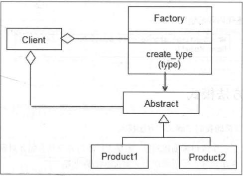
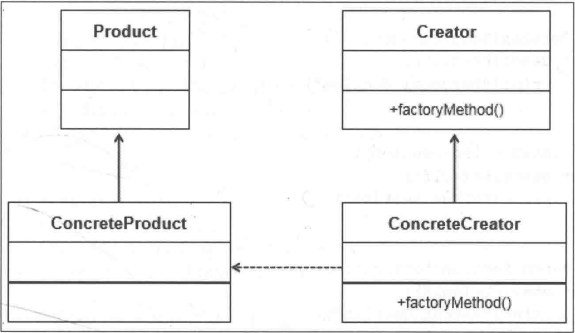

# 工厂模式

## 关注点

- 了解简单工厂设计模式
- 讨论工厂方法和抽象工厂方法及其差异
- 利用Python代码实现真实场景
- 讨论模式的优缺点并进行相应的比较

## 意图

- 一个负责创建其他类型对象的类
- 作为一个工厂的类有一个对象以及与它关联的多个方法
- 客户端使用某些参数调用此方法，之后，工厂会据此创建所需类型的对象，然后将它们返回给客户端

## 优点

- 松耦合，即对象的创建可以独立于类的实现
- 客户端无需了解创建对象的类，但是照样可以使用它来创建对象。它只需要知道需要传递的接口、方法和参数，就能够创建所需类型的对象了。简化了客户端的实现。
- 可以轻松地在工厂中添加其他类来创建其他类型的对象，而这无需更改客户端代码。最简单的情况下，客户端只需要传递另一个参数就可以了。
- 工厂还可以重用现有对象。但是，如果客户端直接创建对象的话，总是创建一个新对象。

## 分类

1. 简单工厂模式
2. 工厂方法模式
3. 抽象工厂模式

## UML

1. 简单工厂模式

    

2. 工厂方法模式

    

3. 抽象工厂模式

    

### 工厂方法的优点

- 它具有更大的灵活性，使得代码更加通用，因为它不是单纯地实例化某个类。这样，实现哪些类取决于接口（Product）， 而不是ConcreteProduct类。
- 它们是松耦合的，因为创建对象的代码与使用它的代码是分开的。客户端完全不需要关心传递哪些参数以及需要实例化哪些类。由于添加新类更加容易，所以降低了维护成本。

## 工厂方法 VS 抽象工厂方法

|工厂方法 | 抽象工厂方法|
|:---:|:---:|
|它向客户端开放了一个创建对象的方法|抽象工厂方法包含一个或多个工厂方法来创建一个系列的相关对象|
|它使用继承和子类来决定要创建哪个对象|它使用组合将创建对象的任务委托给其他类|
|工厂方法用于创建一个产品|抽象工厂方法用于创建相关产品的系列|

## 总结

- 工厂设计模式及其使用上下文
- 工厂的基础知识
- 如何在软件架构中有效使用它
- 工厂设计模式的三种实现
  - 简单工厂
  - 工厂方法模式
  - 抽象工厂方法
