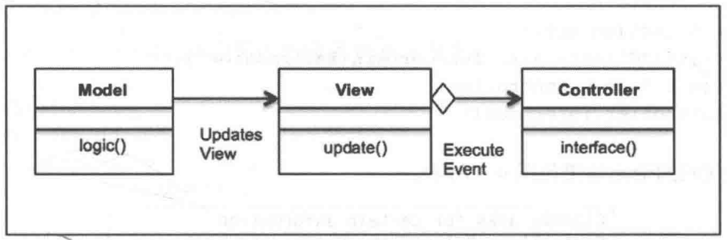

# 模型-视图-控制器-复合模式

## 关注点

- 复合模式和模型-视图-控制器的简介；
- MVC模式及其UML图；
- Python v3.11代码实现的真实用例；
- MVC模式的优缺点；
- 常见问答。

## 简介

在本书中，我们探索了各种设计模式。正如我们所看到的，设计模式可分为三大类:结构型、创建型和行为型设计模式。同时，我们还给出了每种类型的相应示例。然而，在软件实现中，模式并是不孤立地工作的。对于所有软件设计或解决方案来说，很少出现仅利用一种设计模式来实现的情况。

实际上，这些模式通常需要同时使用并加以组合，以实现特定的设计解决方案。根据GoF 的定义，“复合模式将两个或更多模式组合成解决常见或普遍性问题的解决方案。复合模式不是同时使用的一组模式，而是一个问题的通用解决方案。

接下来，我们将考察模型一视图一控制器复合模式，该模式是复合模式的最佳示例,并且已经在许多设计解决方案中应用多年了。

## 模式-视图-控制器模式

MVC不仅是一种实现用户界面的软件模式，同时也是一种易于修改和维护的架构。通常来说，MVC模式将应用程序分为3个基本部分:模型、视图和控制器。这3个部分是相互关联的，并且有助于将信息的处理与信息的呈现分离开来

MVC模式的工作机制为:模型提供数据和业务逻辑(如何存储和查询信息)，视图负责数据的展示(如何呈现)，而控制器是两者之间的粘合剂，根据用户要求的呈现方式来协调模型和视图。有趣的是，视图和控制器依赖于模型，而不是反过来。这主要是因为用户所关心的是数据。模型是可以独立工作的，这是MVC模式的关键所在。

通常来说，人们会用网站为例来介绍 MVC 模式。当你浏览网站时会发生什么呢?你点击一个按钮，几个操作发生，你会看到你想要的内容。这是怎么回事?

- 你是用户，与视图交互。视图就是提供给你的网页。你点击视图上的按钮，它告诉控制器需要做什么。
- 控制器从视图获取输入并将其发送到模型。然后，模型会根据用户执行的操作来完成相应的动作。
- 控制器还可以根据其从用户接收的操作(例如更改按钮，显示其他 UI元素等)要求视图进行相应的改变。
- 模型将状态变化通知视图。这可以基于一些内部变化或外部触发，例如点击按钮等
- 视图随后展示直接从模型获取的状态。例如，如果用户登录到网站，会给他/她呈现一个仪表板视图(登录后)。需要在仪表板中填写的所有详细信息都是由模型提供给视图的。

MVC设计模式使用以下术语——模型、视图、控制器和客户端。

- 模型:声明一个存储和操作数据的类
- 视图:声明一个类来构建用户界面和显示数据。
- 控制器:声明一个连接模型和视图的类
- 客户端:声明一个类，根据某些操作来获得某些结果

为了进一步探讨软件开发术语所说的MVC模式先让我们来看看MVC模式中涉及的
主要类。

- 模型类定义针对数据的所有操作(例如创建、修改和删除)，并提供与数据使用方式有关的方法。
- 视图类代表用户界面。它提供相应的方法，帮助我们根据上下文和应用程序的需要来构建 Web或GUI界面。它不应该包含自己的任何逻辑，而只应该用来显示收到的数据。
- 控制器类从请求接收数据，并将其发送到系统的其他部分。它需要提供用于路由请求的方法。

MVC模式经常用于以下情况。

- 当需要更改展示方式而不更改业务逻辑时。
- 多个控制器可用于使用多个视图来更改用户界面上的展示。
- 再次重申，当模型改变时，视图无需改动，因为它们是相互独立的。

简而言之，MVC模式的主要意图如下。

- 将数据和数据的展示隔离开来
- 使类的维护和实现更加简单。
- 灵活地改变数据的存储和显示方式。两者都是独立的，因此可以灵活修改。

### 模型——了解应用程序的情况

模型是应用程序的基石，因为它独立于视图和控制器，而视图和控制器则依赖于模型。

模型还提供客户端请求的数据。通常，在应用程序中，模型由存储和返回信息的数据库表来表示。模型会提供状态以及改变状态的方法，但它不知道数据是如何展示给客户端的。

至关重要的是，模型必须在多个操作中保持一致;否则，客户端可能会损坏或展示过时的数据，这是无法容忍的。

由于模型是完全独立的，所以，开发模型的人员可以专注于维护模型本身，而无需关心视图的最新变化。

### 视图——外观

视图用来将数据展示在接口上，供客户查看。视图可以独立开发，但不应包含任何复杂的逻辑，因为逻辑应该放在控制器或模型中。

在当今世界中，视图需要足够灵活，并且应该适应多种平台，如桌面、手机、桌面和多种屏幕尺寸。

视图应避免与数据库直接交互，而是依靠模型来获取所需的数据。

### 控制器——胶水

控制器，顾名思义，就是控制用户在界面上的交互。当用户点击界面上的某些元素时，基于对应的交互(点击按钮或触摸)，控制器调用相应的模型，然后模型完成创建、更新或删除数据等动作。

控制器还能将数据传递给视图，以便将信息呈现在接口上，供用户查看。

控制器不应该进行数据库调用或参与数据的展示。控制器应该作为模型和视图之间的粘合剂，并且要尽可能薄。

下面，我们将着手开发一个示例应用程序。下面给出的Python 代码实现了一个MVC设计模式。假设我们想要开发一个应用程序，告诉用户云公司所提供的营销服务，包括电子邮件、短信和语音设施。

我们首先要开发model类(模型)，定义产品提供的服务，即电子邮件、短信和语音这里的每种服务都有特定的费率，例如每 1000封电子邮件将向客户收取2美元，而每 1000条短信，费用为 10美元，同时每 1000条语音留言的费用为15美元。因此，模型提供与产品服务和价格相关的数据。

然后，我们来定义view类(视图)，它提供了将信息反馈给客户端的方法。这些方法是list services()和list pricing()，从方法名称不难看出，一个是用于打印产品提供的服务，另一个是用来列出服务的定价。

接下来,我们开始定义Controller类这个类定义了两个方法,即get services()和get pricing()。这两个方法都是用来查询模型并获取数据的，然后将数据馈送到视图，从而展示给用户。

## UML

在UML图中，我们可以看到这个模式中的3个主要类:

- Model类: 定义与客户端的某些任务有关的业务逻辑或操作。
- View类: 定义客户端查看的视图或展示。模型根据业务逻辑向视图呈现数据
- Controller类: 这实际上是视图和模型之间的接口。当客户端采取某些操作时控制器将来自视图的查询传递给模型。

## 现实世界中的MVC模式

我们从前的Web应用程序框架也是基于MVC的优秀理念的以Django或Rails(Ruby)
为例:它们都是以模式一视图一控制器格式来构造项目的，只是形式为模型、模版、视图
(Model-Template-View，MTV)，其中模型是数据库，模板是视图，控制器是视图/路由。举例来说，假设要用Tornado Web 应用程序框架(http://www.tornadoweb.org/en/stable/)来开发一个单页应用程序。这个应用程序用于管理用户的各种任务，同时用户还具有添加任务、更新任务和删除任务的权限。

让我们来了解一下设计的注意事项:

- 让我们先从控制器开始。在Tormado中，控制器被定义为视图/应用程序路由。我们需要定义多个视图，例如列出任务、创建新任务、关闭任务，以及在无法处理请求时的操作;
- 我们还应该定义模型，即列出、创建或删除任务的数据库操作;
- 最后，视图由 Tormado中的模板显示。对于应用程序来说，我们需要一个模板来显示、创建或删除任务，以及另一个模板用于没有找到URL时的情形。

### 模块

模型是应用程序的基石，因为它独立于视图和控制器，而视图和控制器则依赖于模型。

模型还提供客户端请求的数据。通常，在应用程序中，模型由存储和返回信息的数据库表来表示。模型会提供状态以及改变状态的方法，但它不知道数据是如何展示给客户端的。

至关重要的是，模型必须在多个操作中保持一致:否则，客户端可能会损坏或展示过时的数据，这是无法容忍的。

由于模型是完全独立的，所以，开发模型的人员可以专注于维护模型本身，而无需关心视图的最新变化。

### MVC模式的优点

- 使用MVC，开发人员可以将软件应用程序分为3个主要部分:模型、视图和控制器。这有助于提高可维护性，强制松耦合，并降低复杂性。
- MVC允许对前端进行独立更改，而对后端逻辑无需任何修改或只需进行很少的更改，因此开发工作仍可以独立运行。
- 类似地，可以更改模型或业务逻辑，而无需对视图进行任何更改
- 此外，可以更改控制器，而不会对视图或模型造成任何影响。
- MVC还有助于招聘具有特定能力的人员，例如平台工程师和UI工程师，他们可以在自己的专业领域独立工作。

## 常见问答

1. Q: MVC是不是一种模式?为什么被称为复合模式?
    A: 本质上来说，复合模式就是相互配合共同解决软件应用程序开发中的大型设计问题的一组模式。MVC模式是最受欢迎的同时也是应用最为广泛的复合模式。由于它的应用如此广泛而可靠，所以它通常被看作是一个模式。

2. Q: MVC只能用于网站吗?
    A: 不，网站是描述MVC 的最好的例子。然而，MVC可以用于多个领域，例如GUI应用程序或任何其他需要松散耦合和需要拆分组件使其保持独立的地方。MVC的典型示例包括博客、电影数据库应用程序和视频流 Web 应用程序。虽然MVC 在许多地方都很有用但如果你将它用于着陆页、市场营销内容或快速单页应用程序，那也没什么好说的。

3. Q: 多个视图可以使用多个模型吗?
    A: 是的，通常你最终会遇到需要从多个模型整理数据并在一个视图中显示的情况。一对一地映射在当今的网络应用程序世界中是非常罕见的。
