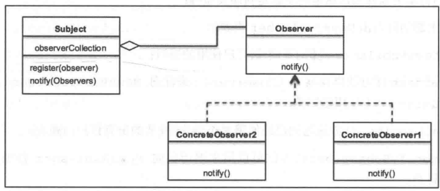

# 观察者模式

## 关注点

- 行为型设计模式简介
- 观察者模式及其UML图
- 利用Python v3.5代码是心啊一个真实用例
- 松耦合的强大威力
- 常见问答

## 理解

主要目标：

1. 它定义了对象之间的一对多的依赖关系，从而使得一个对象中的任何更改都将自动通知给其他依赖对象；
2. 它封装了主题的核心组件

适用场景：

1. 在分布式系统中实现事件服务；
2. 用作新闻机构的框架；
3. 股票市场也是观察者模式的一个大型场景。

## UML

主要角色：主题、抽象观察者、具体观察者

- 主题（Subject）：类Subject需要了解Observer。Subject类具有许多方法，诸如register()和deregister()等，Observer可以通过这些方法注册到Subject类中。因此，一个Subject可以处理多个Observer。
- 抽象观察者（Observer）：它为关注主题的对象定义了一个接口。它定义了Observer需要实现的各个方法，以便在主题发生变化时能够获得相应的通知。
- 具体观察者（ConcreteObserver）：它用来保存应该与Subject的状态保持一致的状态。它实现了Observer接口以保持其状态与主题中的变化相一致。

## 通知方式

1. 拉模型

    - 每当发生变化时， 主题都会向所有已注册的观察者进行广播。
    - 出现变化时，观察者负责获取相应的变化情况，或者从订户那里拉取数据。
    - 拉模型的效率较低，因为它涉及两个步骤，第一步，主题通知观察者；第二部观察者从主题那里提取所需的数据。

2. 推模型

    - 与拉模型不同， 变化由主题推送到观察者的。
    - 在拉模型中，主题可以向观察者发送详细的信息（即使可能不需要）。当主题发送大量观察者用不到的数据时，会使响应时间过长。
    - 由于只从主题发送所需的数据，所以能够提高性能。

## 松耦合与观察者模式

1. 松耦合

    - 它降低了在一个元素内发生的可能对其他元素产生意外影响的风险；
    - 它使得测试、维护和故障排除工作更加简单；
    - 系统可以轻松地分解为可定义的元素。

2. 观察者模式

    - 主题对观察者唯一的了解就是它实现一个特定的接口。同时，它也不需要了解具体观察者类。
    - 可以随时添加任意的新观察者。
    - 添加新的观察者时，根本不需要修改主题。在本示例中，我们看到任意其他观察者可以任意添加/删除，而无需在主题中进行任何的更改。
    - 观察者或主题没有绑定在一起，所以可以彼此独立使用。如果需要的话，观察者可以在任何地方重复使用。
    - 主题或观察者中的变化不会相互影响。由于两者都是独立的或松散耦合的，所以它们可以自由地做出自己的改变。

## 优缺点

1. 优点

    - 它使得彼此交互的对象之间保持松耦合；
    - 它使得我们可以在无需对主题或观察者进行任何修改的情况下高效地发送数据到其他对象；
    - 可以随时添加/删除观察者。

2. 缺点

    - 观察者接口必须由具体观察者实现，而这涉及继承。无法进行组合，因为观察者接口可以实例化；
    - 如果实现不当的话，观察者可能会增加复杂性，并导致性能降低；
    - 在软件应用程序中，通知有时可能是不可靠的，并导致竞争条件或不一致性。
