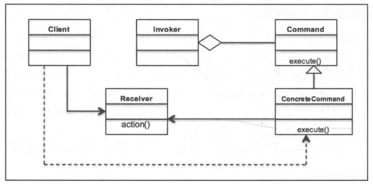

# 命令模式

## 关注点

- 命令模式简介；
- 命令模式及其UML图；
- Python v3.5代码实现的真实用例；
- 命令模式的优缺点；
- 常见问答。

## 命令模式简介

行为模式侧重于对象的响应性。它利用对象之间的交互实现更强大的功能。

命令模式是一种行为设计模式，其中对象用于封装在完成一项操作时或在触发一个事件时所需的全部信息。这些信息包括以下内容：

- 方法名称；
- 拥有方法的对象；
- 方法参数的值。

## 了解命令设计模式

常用术语：

- Command对象了解Receiver对象的情况，并能调用Receiver对象的方法；
- 调用者方法的参数值存储在Command对象中；
- 调用者知道如何执行命令；
- 客户端用来创建Command对象并设置其接收者。

主要意图：

- 将请求封装为对象；
- 可用不同的请求对客户进行参数化；
- 允许将请求保存在队列中（我们将在本章后面进行讨论）；
- 提供面向对象的回调。

适用场景：

- 根据需要执行的操作对对象进行参数化；
- 将操作添加到队列并在不同地点执行请求；
- 创建一个结构来根据较小操作完成高级操作。

## UML

主要涉及的5个参与者：

- Command：声明执行操作的接口。
- ConcreteCommand：将一个Receiver对象和一个操作绑定在一起。
- Client：创建ConcreteCommand执行这个请求。
- Receiver：知道如何实施与执行一个请求相关的操作。

## 与云应用密切相关的两个实现

1. 重做或回滚操作：

    - 在实现回滚或重做操作时，开发人员可以做两件不同的事情；
    - 这些是在文件系统或内存中创建快照，当被要求回滚时，恢复到该快照；
    - 使用命令模式时，可以存储命令序列，并且要求进行重做时，重新运行相同的一组操作即可。

2. 异步任务执行：

    - 在分布式系统中，我们通常要求设备具备异步执行任务的功能，以便核心服务在大量请求涌来时不会发生阻塞。
    - 在命令模式中，Invoker对象可以维护一个请求队列，并将这些任务发送到Receiver对象，以便他们可以独立于主应用程序线程来完成相应的操作。

## 优缺点

1. 优点

    - 将调用操作的类与知道如何执行该操作的对象解耦；
    - 提供队列系统后，可以创建一系列命令；
    - 添加新命令更加容易，并且无需更改现有代码；
    - 还可以使用命令模式来定义回滚系统，例如，在向导示例中，我们可以编写一个回滚方法。

2. 缺点

     - 为了实现目标，需要大量的类和对象进行写作。应用程序开发人员为了正确开发这些类，需要倍加小心；
     - 每个单独的命令都是一个ConcreteCommand类，从而增加了需要实现和维护的类的数量。
