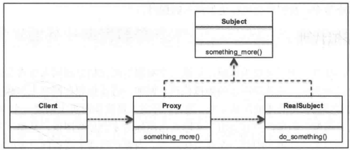

# 代理模式

## 关注点

- 介绍代理和代理设计模式
- 代理模式的UML图
- 代理模式的变体
- 利用Python v3.5代码实现的真实用例
- 代理模式的优点
- 门面模式和代理模式之间的比较
- 常见问答

## 理解

代理通常就是一个介于寻求方和提供方之间的中介系统。寻求方是发出请求的一方，而提供方则是根据请求提供资源的一方。

在Web世界中，它相当于代理服务器。客户端（万维网中的用户）在向网站发出请求时，首先连接到代理服务器，然后向它请求诸如网页之类的资源。代理服务器在内部评估此请求，将其发送到适当的服务器，当它收到响应后，就会将响应传递给客户端。因此，代理服务器可以封装请求、保护隐私，并且非常适合在分布式架构中运行。

在设计模式的上下文中，代理是充当实际对象接口的类。对象类型可以是多样化的，例如网络连接、内存和文件中的大对象，等等。简而言之，代理就是封装实际服务对象的包装器或代理人。代理可以为其包装的对象提供附加功能，而无需更改对象的代码。代理模式的主要目的是为其他对象提供一个代理者或占位符，从而控制对实际对象的访问。

## 适用场景

- 它能够以更简单的方式表示一个复杂的系统。
- 它提高了现有的实际对象的安全性。
- 它为不同服务器上的远程对象提供本地接口。
- 它为消耗大量内存的对象提供了一个轻量级的句柄。

## UML图

### 主要参与者

#### 代理

维护一个引用，允许代理（Proxy）通过这个引用来访问实际对象。它提供了一个与主题（Subject）相同的接口，以便代理可以替换真实的主题。代理还负责创建和删除真实主题（RealSubject）。

#### 主题

定义了RealSubject和Proxy的公共接口。以Proxy和RealSubject的形式实现主题（Subject），使用RealSubject的任何地方都可以使用代理（Proxy）。

#### 真实主题

它定义代理（Proxy）所代表的真实对象。

### 数据结构的角度来看

#### 代理

它是一个控制对RealSubject类访问的类。他处理客户端的请求，负责创建或删除RealSubject。

#### 主题/真实主题

主题是定义真实主题（RealSubject）和代理（Proxy）相类似的接口。RealSubject是Subject接口的实际实现。它提供了真正的功能，然后由客户端使用。

#### 客户端

它访问要完成工作的Proxy类。Proxy类在内部控制对RealSubject的访问，并引导客户端所请求的工作。

## 代理的类型

- 虚拟代理：如果一个对象实例化后会占用大量内存的话，可以先利用占位符来表示，这就是所谓的虚拟代理。
- 远程代理：它给位于远程服务器或不同地址空间上的实际对象提供了一个本地表示。
- 保护代理：这种代理能够控制RealSubject的敏感对象的访问。
- 智能代理：智能代理在访问对象时插入其他操作。

## 代理模式的优点

- 代理可以通过缓存笨重的对象或频繁访问的对象来提高应用程序的性能
- 代理还提供对于真实主题的访问授权。因此，只有提供合适权限的情况下，这个模式才会接受委派。
- 远程代理还便于与可用作网络连接和数据库连接的远程服务器进行交互，并可用于监视系统。

## 与门面模式的比较

|代理模式|门面模式|
|:---:|:---:|
|它为其他对象提供了代理或占位符，以控制对原始对象的访问|它为类的大型子系统提供了一个接口|
|代理对象具有与其木比奥对象相同的几口，并保存有木比奥对象给的引用|它实现了子系统之间的通信和依赖性的最小化|
|他充当客户端和被封装的对象之间的中介|门面对象提供了单一的简单接口|

## 代理模式的去欸但

- 代理模式会增加响应时间。

## 常见问答

1. Q: 装饰器模式和代理模式之间有什么区别?
    A: 装饰器向在运行时装饰的对象添加行为，而代理则是控制对对象的访问。代理和真实主题之间的关联是在编译时完成的，而不是动态的。

2. Q: 代理模式的缺点是什么?
    A: 代理模式会增加响应时间。例如，如果代理没有良好的体系结构或存在性能问题它就会增加真实主题的响应时间。一般来说，这一切都取决于代理写得有多好。

3. Q: 客户端可以独立访问真实主题吗?
    A: 是的，但是代理模式能够提供许多优势，例如虚拟、远程等，所以使用代理模式会更好一些。

4. Q: 代理是否能给自己添加任何功能?
    A: 代理可以向真实主题添加额外的功能，而无需更改对象的代码。代理和真实主题可以实现相同的接口。
