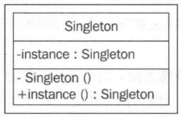

# 单例模式

## 关注点

- 理解单例设计模式
- 单例模式实例
- 单例设计模式的Python实现
- Monostate(Borg)模式。

## 意图

- 确保类有且仅有一个对象被创建。
- 为对象提供一个访问点，以使程序可以全局访问该对象。
- 控制共享资源的并行访问。

## UML



## 代码定义

```Python
class Factory:
    def __new__(cls):
        if not hasattr(cls, 'instance'):
            cls.instance = super(Singleton, cls).__new__(cls)
        return cls.instance
    def instance(self):
        return self.__instance
```

## 分类

1. 普通单例模式
2. 单例模式的懒汉式实例化
3. 模块级别的单例模式
4. Monostate单例模式
5. 单例和元类

## 实例

1. Datebase()
2. HealthCheck()

## 缺点

1. 全局变量可能在某处已经被误改，但是开发人员仍然认为他们没有发生变化，而该变量还在应用程序的其他位置被使用。
2. 可能会对同一个对象创建多个引用。由于单例只创建一个对象，因此这种情况下会对同一个对象创建多个引用。
3. 所有依赖于全局变量的类都会由于一个类的改变而紧密耦合为全局数据，从而可能在无意中影响另一个类。

## 总结

- 应用场景：要求一个类只有一个对象
- 实现单例模式的几种方法：普通单例、懒汉单例
- Borg或Monostate模式，这是单例模式的一个变体
- 实例：Web应用程序，数据库操作
- 单例模式的缺陷
