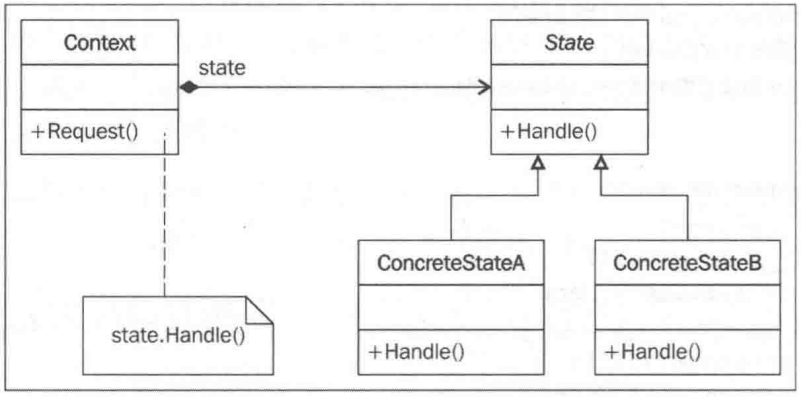

# 状态设计模式

## 关注点

- 国家设计模式简介
- 状态设计模式及其UML图
- 利用Python v3.11代码实现的真实用例
- 状态模式的优缺点

## 定义

行为模式关注的是对象的响应性。它们通过对象之间的交互以实现更强大的功能。状态设计模式是一种行为设计模式，有时也被称为状态模式的对象。在此模式中，一个对象可以基于其内部状态封装多个行为。状态模式也可以看作是在运行时改变对象行为的一种方式。

状态模式允许对象在其内部状态变化时改变其行为。这看起来就像对象本身已经改变了它的类一样。状态设计模式常用于开发有限状态机，并帮助协调状态处理操作。

## 理解

主要参与者：

- state: 这被认为是封装对象行为的接口。这个行为与对象的状态相关联
- ConcreteState: 这是实现 state 接口的子类。ConcreteState 实现与对象的特定状态相关联的实际行为。
- Context: 这定义了客户感兴趣的接口。Context 还维护一个ConcreteState子类的实例，该子类在内部定义了对象的特定状态的实现。

## UML

- state:这是一个定义了 Handle()抽象方法的接口。Handle()方法需要通过ConcreteState类来实现。
- ConcreteState:在这个UML 图中，我们定义了两个 Concrete类:ConcreteStateA和 ConcreteStateB。它们都实现了 Handle()方法，并可以根据状态的变化定义要采取的实际动作。
- context:这是一个接受客户端请求的类。它还维护着对象的当前状态的引用。这样，就可以根据相应的请求，来调用具体的行为了。

## 优缺点

1. 优点

    - 在状态设计模式中，对象的行为是其状态的函数结果，并且行为在运行时根据状态而改变。这消除了对if/else或switch/case 条件逻辑的依赖。例如，在电视远程遥控的场景中，我们还可以通过简单地写一个类和方法来实现相应的行为，但是该类和方法将用到参数，并使用 if/else 语句块来执行具体操作(打开/关闭电视)。
    - 使用状态模式，实现多态行为的好处是显而易见的，并且更易于添加状态来支持额外的行为。
    - 状态设计模式还提高了聚合性,因为特定于状态的行为被聚合到concretestate类中，并且放置在代码中的同一个地方。
    - 使用状态设计模式，通过只添加一个 concretestate 类来添加行为是非常容易的。因此，状态模式不仅改善了扩展应用程序行为时的灵活性，而且全面提高了代码的可维护性。

2. 缺点

    - 类爆炸:由于每个状态都需要在 concretestate的帮助下定义，因此我们可能导致创建了太多功能较为单一的类。我们不妨考虑有限状态机的情况一-如果有许多状态，但每个状态与另一个状态没有太大不同，我们仍然需要将它们写成单独的concretestate类。这既增加了代码量，又使得状态机的结构更加难以审查。
    - 随着每个新行为的引入(即使添加行为只是添加一个concretestate),Context类都需要进行相应的更新以处理每个行为。这使得上下文行为更容易受到每个新的行为的影响。
