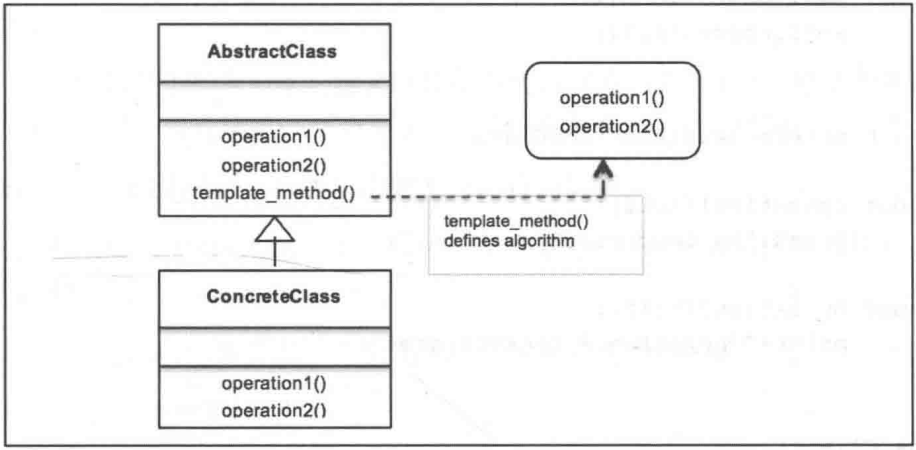

# 模板方法模式

## 关注点

- 模板方法设计模式简介；
- 模板方法模式及其UML图；
- Python v3.11 代码实现真实用例；
- 模板方法模式的优缺点；
- 好莱坞原则、模板方法和模板钩子
- 常见问答。

## 定义模板方法模式

行为模式主要关注对象的响应性。它处理对象之间的交互以实现更强大的功能。

模板方法模式是一种行为设计模式，通过一种称为模板方法的方式来定义程序框架或算法。

模板方法模式还通过这些步骤中的一些实现推迟到子类来帮助重新定义或定制算法的某些步骤。这意味着子类可以重新定义自己的行为。

需要重点关注的是，步骤的改变（如子类所做的）并不影响原始算法的结构。因此在模板方法模式中的子类可以通过覆盖来创建不同的行为或算法。

适用场景：

- 当多个算法或类实现类似或相同逻辑的时候；
- 在子类中实现算法有助于减少重复代码的时候；
- 可以让子类利用覆盖实现行为来定义多个算法的时候。

## 了解模板方法设计模式

主要意图：

- 使用基本操作定义算法的框架；
- 重新定义子类的某些操作，而无需修改算法的结构；
- 实现代码重用并避免重复工作；
- 利用通用接口或实现。

使用的术语：

- AbstractClass：定义一个定义算法步骤的接口。
- ConcreteClass：定义子类特定的步骤。
- template_method()：通过调用步骤方法来定义算法。

假设想为iOS设备开发自己的交叉编译器并运行程序。

我们首先开发一个抽下功能类（编译器），来定义编译器的算法。编译器执行的操作是收集由程序语言编写的源代码，然后编译成目标代码（二进制格式）。我们将这些步骤定义为collectSource()和compileToObject()抽象方法，同时还定义了负责执行程序的run()方法。该算法是由compileAndRun()方法来定义的，它通过内部调用collectSource()、compileToObject()和run()方法来定义编译器的算法。

然后让具体类iOSCompiler实现抽象方法，在iOS设备上编译并运行Swift代码。

## UML

主要参与者：

- AbstractClass：在抽象方法的帮助下定义算法的操作或步骤。这些步骤将被具体子类覆盖。
- template_method()：定义算法的框架。在模板方法中调用抽象方法定义的多个步骤来定义序列或算法本身。
- ConcreteClass：实现（由抽象方法定义的）步骤，来执行算法子类的特定步骤。

## 现实生活中的模板方法模式

旅行社设计，设计注意事项：

- 对于上述场景，根据UML图来看，我们应该创建一个定义旅行的AbstractClass接口；
- 旅行应包含多个抽象方法，定义所使用的交通方式，在第1、2、3天所游览的地点（假设这是个为期3天的周末旅行），并定义回程；
- 模板方法itinerary()将实际定义该旅行的行程；
- 我们应该定义ConcreteClasses，以帮助我们根据客户的需要对旅行进行相应的定制。

从Trip类开始具体化：

- 抽象对象由Trip类表示。他是一个接口（Python的抽象基类），定义了不同日子使用的交通方式和参观的地点等细节；
- setTransport是一个抽象方法，它由ConcreteClass实现，作用是设置交通方式；
- day1()、day2()、day3()抽象方法定义了特定日期所参观的地点；
- itinerary()模板方法创建完整的行程（即算法，在本例中为旅行）。类型的序列为，首先定义交通模式，然后是每天要参观的地点，以及returnHome。

代表具体类的某些类：

- 在本例中，我们主要有两个实现Trip接口的具体类：VeniceTrip和MaldivesTrip；
- 这两个具体类代表游客根据他们的选择和兴趣所进行的两次不同的旅行；
- VecniceTrip和MaldivesTrip都实现了色图Transport()、day1()、day2()、day3()和returnHome()。

考察旅行社和希望度过一个愉快假期的游客；

- TravelAgency类代表该示例中的Client对象；
- 它定义了arrange_trip()方法，让客户选择历史旅行或海滩旅行；
- 根据旅游者的选择，相应的类将被实例化；
- 这个对象然后调用itinerary()模板方法，并根据客户的选择为游客安排相应的旅行。

## 模板方法模式——钩子

钩子是在抽象类中声明的方法，它通常被赋予一个默认实现。钩子背后的思想是为子类提供按需钩取算法的能力。但是，它并不强制子类使用钩子，它可以很容易地忽略这一点。

通常情况下，当子类必须提供实现时，我们会使用抽象方法，并且当子类的实现不是强制的时候，我们就会使用钩子。

## 好莱坞原则与模板方法

好莱坞原则是一种设计原则，即不要给我们打电话，我们会打给你的。它来自好莱坞哲学，如果有适合演员的角色，影棚会给演员打电话。

在面向对象的世界中，我们允许低层组件使用好莱坞原则将自己挂入系统中。然而高层组件确定低层系统的使用方式，以及何时需要它们。换句话说，高层组件对待低层组件的方式也是不要给我们打电话，我们会打电话给你。

这涉及模板方法模式，在这个意义上，它是高级抽象类，它安排定义算法的步骤。根据算法的工作方式，通过调用低层类来定义各个步骤的具体实现。

## 优缺点

1. 优点

    - 正如我们在本章前面所看到的，没有代码重复；
    - 由于模板方法模式使用继承而不是合成，因此能够对代码进行重用。所以，只有为数不多的几个方法需要重写；
    - 灵活性允许子类决定如何实现算法中的步骤。

2. 缺点

    - 调试和理解模板方法模式中的流程序列有时会令人困惑。你最终实现的方法可能是一个不应该实现的方法，或根本没有实现抽象方法。文档和严格的错误处理必须由程序员完成。
    - 模板框架的维护可能是一个问题，因为任何层次（低层或高层）的变更都可能对实现造成干扰。因此，使用模板方法模式可能会使维护变得异常痛苦。

## 常见问答

1. Q: 是否应该禁止底层组件调用更高层组件中的方法?
    A: 不，底层组件当然通过继承来调用高层组件。然而，程序员需要注意的是，不要出现循环依赖性，即高层组件和底层组件彼此依赖。

2. Q: 策略模式是否类似于模板模式?
    A: 策略模式和模板模式都是封装算法。

模板取决于继承，而策略使用组合。模板方法模式是通过子类化在编译时进行算法选
择，而策略模式是在运行时进行选择。
